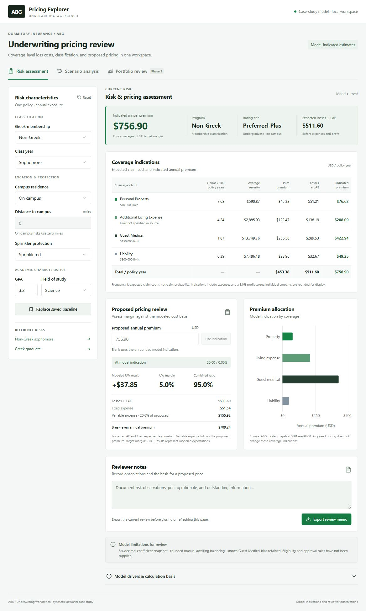

# ABG Pricing Explorer

A local underwriting workbench backed by React, FastAPI, and the original ABG Python rating function. The case-study notebooks live in `notebooks/`, with their original rating code in `src/`. The explorer's interface is in `abg-explorer/` and its pricing API is in `backend/`. The original notebooks and handoff were read as project context and were not modified.

## Use it

Double-click **Start-ABG.cmd** in this folder. It opens `http://127.0.0.1:8011/` in your browser. Keep the launcher window open while using the explorer; close it to stop the service. If the service is already running, the launcher reuses it.

**Risk assessment** updates program, tier, indicated annual premium, and expected losses + LAE as you change the seven risk characteristics. The coverage table exposes frequency (claims per 100 policy years), average severity, pure premium, losses + LAE, and each coverage's indicated premium. On-campus distance is always zero. “Model drivers & calculation basis” lists the actual predictors used by each fitted model and explains the expense/profit calculation.

**Proposed pricing review** evaluates a proposed total annual premium against the modeled cost basis. Blank uses the unrounded model indication. Losses + LAE and fixed expenses remain constant; variable expense is 20.6% of the proposed premium. Underwriting result = proposed premium − losses/LAE − fixed expense − variable expense; margin = result / proposed premium; combined ratio = total modeled costs / proposed premium. Break-even premium = (losses + LAE + fixed expense) / (1 − 20.6%). Proposed pricing does not change coverage indications or infer a coverage allocation. The 5% target margin remains the case-study assumption.

**Scenario analysis** compares the current risk against a saved baseline, showing changed characteristics, program/tier transitions, annual dollar and percentage variances, and changes by coverage. The baseline is stored on this device; both risks are re-scored with the current model. “Restore inputs” brings back the saved risk. The two reference risks are available in the input panel.

**Reviewer notes** remain on the current page until it is closed or refreshed. “Export review memo” downloads a Markdown record of the current inputs, model snapshot, coverage indications, proposed pricing economics, active scenario comparison, notes, and limitations. Export is disabled while results are stale or inputs are invalid. The export records modeled pricing, not an approval decision. No eligibility, approval, or binding rules have been supplied.

**Portfolio review** remains explicitly **Phase two**, with starting-book reference values and the outstanding prerequisites. It does not produce a three-year forecast. A portfolio simulator and publishing remain later work, as requested.

## Model provenance and limits

- `backend/model/src/rating.py` is a byte-for-byte copy of the supplied function. It remains the scoring source of truth. All math runs in Python.
- The original CSV exports were absent. All 42 frequency/severity coefficients were recovered from the saved HTML table in `08_CombinedModels.ipynb`, cell 2, at six-decimal display precision. No notebook was executed and no model was refitted.
- Severity intercepts already include the log-normal mean correction. It is not applied a second time.
- Fixed expense uses the handoff's rounded book mean loss + LAE per coverage: 113.76, 325.97, 493.04, and 77.73, multiplied by 0.051. It totals $51.5355 before display rounding and is flat across applicants.
- LAE = 8.5 / 66.2; variable expense = 20.6%; target underwriting profit = 5%. These are case-study assumptions from notebook 10, not current external estimates.
- The UI displays **model-indicated estimates**. It does not implement the unfinished rounded/rebalanced rating manual or correct the known Guest Medical retransformation bias.
- This is a synthetic case study. It is not a binding insurance quote.
- The portfolio dataset is absent, so exact book means and manual balancing cannot be re-verified. Full-precision exports and the portfolio are needed for that next phase.

The recorded notebook and rating-function hashes are in `backend/model/provenance.json`. Recreate the recovered snapshot with:

```powershell
python scripts/import_notebook_model.py . backend/model
```

## Setup on another machine

Requires Python 3.13+ and Node.js 22.13+.

```powershell
python -m venv .venv
.\.venv\Scripts\python.exe -m pip install -r backend/requirements-dev.txt
Set-Location abg-explorer
npm.cmd ci
npm.cmd run build
Set-Location ..
.\Start-ABG.ps1
```

If Node reports a certificate chain error in a managed environment, use its system CA support: `node --use-system-ca 'C:\Program Files\nodejs\node_modules\npm\bin\npm-cli.js' ci`. Certificate verification remains enabled.

For development, run `.\.venv\Scripts\python.exe -m uvicorn backend.app:app --host 127.0.0.1 --port 8011` from the root and `npm.cmd run dev` from `abg-explorer` in a second terminal. The React development preview at `http://127.0.0.1:5173/` proxies `/api` to Python. Production is a static React bundle served directly by FastAPI from the same origin.

## Verification

```powershell
.\.venv\Scripts\python.exe -m pytest backend/tests -q
Set-Location abg-explorer
node node_modules/typescript/bin/tsc --noEmit
npm.cmd run build
```

The tests reproduce both saved notebook 08 examples (coverage pure premiums within $0.002), the handoff's two worked premiums (within $0.03 because of snapshot precision), all eight program/tier cells, expense accounting, invalid inputs, and scenario differences. They also verify proposed-premium costs, margin/combined-ratio accounting, break-even pricing, proposed-price validation, scenario pricing review, and the predictor lists. Example comparison: a Non-Greek sophomore, sprinklered, GPA 3.2, Science indicates $756.90 on campus versus $966.37 five miles off campus: +$209.47, +27.68%.

No public deployment is created by these commands. The requested Python API requires a Python-capable host for a future deployment.

## Preview


